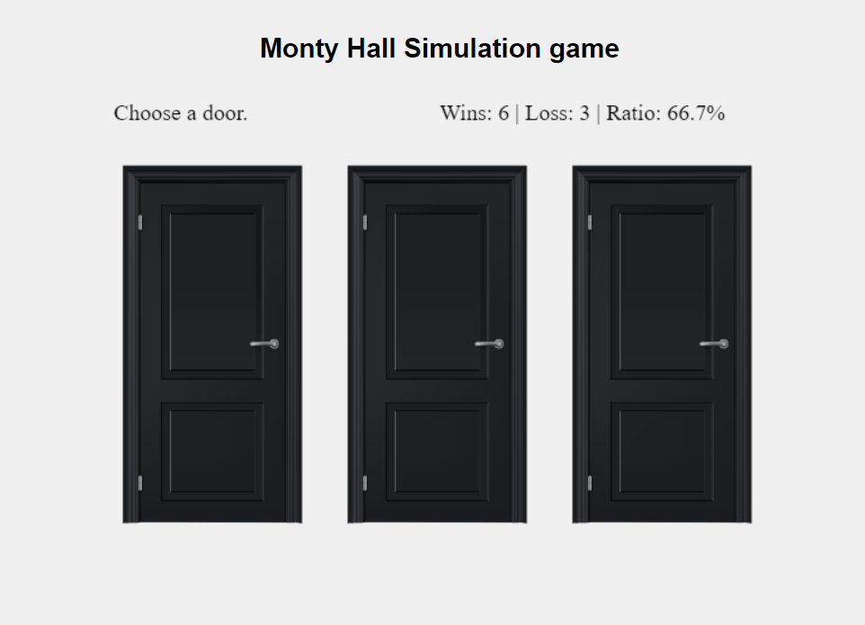
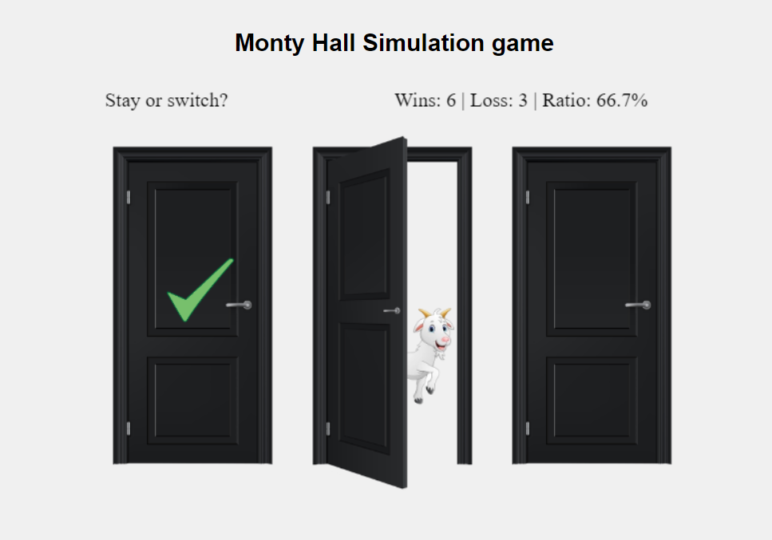
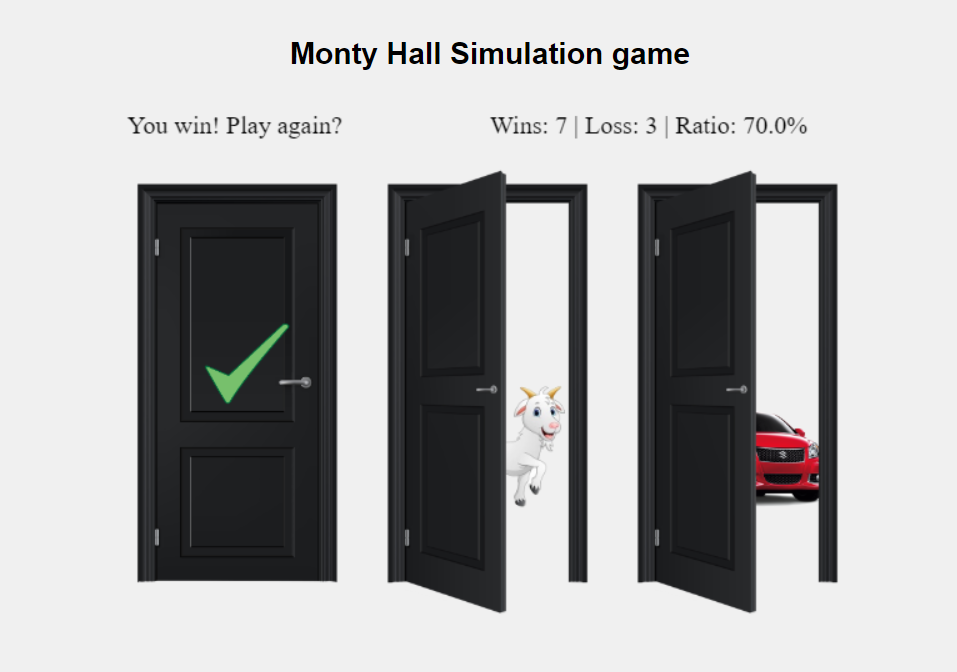
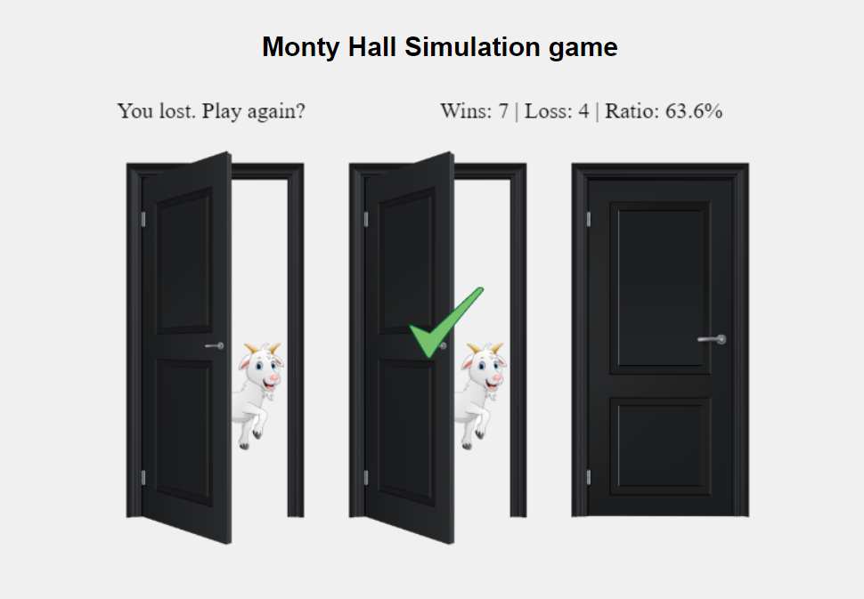

# Monty Hall Simulation game
The Monty Hall problem is deciding whether you do. The correct answer is that you do want to switch. If you do not switch, you have the expected 1/3 chance of winning the car, since no matter whether you initially picked the correct door, Monty will show you a door with a goat.

The project was build using vanilla JavaScript and canvas
<table style="padding:10px">
	<tr>
		<td></td>
		<td></td>
	</tr>
	<tr>
		<td></td>
		<td></td>
	</tr>
</table>